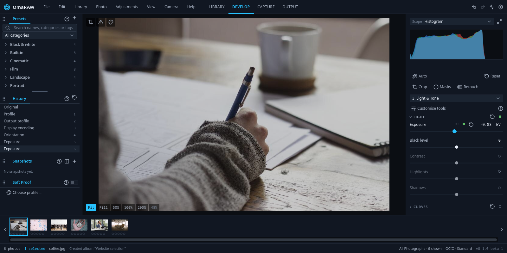

# OmaRAW

A photo library and RAW editor for [Omarchy](https://omarchy.org) and Arch Linux.
Import a shoot, choose your keepers, develop your photographs and export them
from one window. Your originals stay in ordinary folders; edits are saved
separately, so you can always return to the starting image.



**First beta · Linux x86_64.** Start with a small collection and keep backups
of your photographs and catalog. Camera support and tethering depend on the
camera; GPU acceleration depends on its driver.

## Install

Download the beta package from
[Releases](https://github.com/28allday/omaraw/releases).

On Omarchy or Arch Linux:

1. Open a terminal (**Super+Enter** on Omarchy).
2. Download and run the installer:

   ```sh
   curl -fLO https://raw.githubusercontent.com/28allday/omaraw/master/install.sh
   bash install.sh
   ```

3. Enter your password when asked and confirm the packages to install.
4. Open **OmaRAW** from your application launcher (**Super+Space** on Omarchy).

The installer downloads the beta, checks its checksum and installs its
requirements. It also installs the agent skill described below. You do not need
to compile the app or install its processing engine separately.

For a private repository, use the manual download below while signed in to
GitHub. Browser sign-in does not authenticate the terminal installer.

For manual installation, download the package and `SHA256SUMS` from Releases
into the same folder. Open a terminal in that folder, verify the download,
then install:

```sh
sha256sum --check --ignore-missing SHA256SUMS
sudo pacman -U ./omaraw-0.1.0beta3-1-x86_64.pkg.tar.zst
```

Continue only if the package checksum reports **OK**.

Packages are currently unsigned. Use the files from this repository's Releases
page. Other distributions and ARM do not have a supported package yet.

## Getting started

OmaRAW has four workspaces across the top:

- **Library** — import, browse, compare and organise photographs.
- **Develop** — adjust the selected photograph, with presets and history on the
  left, the image in the centre and editing tools on the right.
- **Capture** — work with a connected camera and bring new captures into your catalog.
- **Output** — export photographs, make contact sheets or prepare a print PDF.

To edit your first photograph:

1. Press **Ctrl+I**, choose a folder and tick the photos to import. Choose **Add**
   to leave them where they are, or **Copy** to put copies in a photo folder.
2. Use **0–5** for stars, **P** for a pick and **X** for a reject.
3. Select a photograph and open **Develop** (**Ctrl+2**). Start with white balance
   and Light; **Auto** gives you a starting exposure.
4. Open **Output** (**Ctrl+4**), choose a destination, format and size, then export.

Press **F1** for the built-in guide, or the **?** on a panel for help with that
tool. **Ctrl+K** finds commands by name. The full [user guide](docs/USER-GUIDE.md)
is also available without opening the app.

## Organise a shoot

Browse in a grid or Loupe, compare photographs side by side, and use stars,
flags, colour labels and keywords to find your keepers. Albums group photographs
without duplicating the files: select photos, right-click and choose **Add to
Album**. Smart albums collect photographs by rules.

Stacks keep related pictures together. Variants let you try different edits of
the same original. Smart Previews and verified offline copies let you continue
supported work when the original drive is disconnected.

## Develop your photographs

Adjust exposure, white balance, curves, colour wheels, detail and lens
corrections. Every edit has history and Undo; snapshots let you keep and compare
versions along the way.

Use brush, gradient, radial and editable pen masks to work on part of an image.
A **Colour Range** mask samples a colour, such as skin, and lets you refine its
range and softness before making local adjustments. Combine it with a shape
to leave similar colours elsewhere alone.

Presets, film simulations, LUTs and Image Match provide starting looks.
Right-click an edited photograph and choose **Copy Settings…**, then **Paste
Settings** on your selection. **Sync Settings…** transfers the adjustment groups
you choose across a batch.

AI tools make object selections, remove objects and denoise RAWs. All models
and AI runtime libraries are included in the package and work offline after
installation, with no further downloads or setup. Photograph processing stays
on your computer. Automatic subject tags also use an included model.
See [AI tools](docs/AI-TOOLS.md) and [AI denoise](docs/AI-DENOISE.md) for support
and requirements.

## Export and share

Export JPEG, TIFF, PNG, WebP, AVIF, JPEG XL or flat PSD, with controls for size,
quality, colour and metadata. Make contact sheets or print PDFs for a lab or
another printing application.

Full-quality export needs the original or a verified full offline copy.
Smart Previews are smaller editing sources and are not backups.

## Use OmaRAW with an agent

The package includes an **OmaRAW skill** that teaches coding agents how to
inspect, edit, organise and export photos through the same application engine.
Installation links it for your user, following Omarchy's agent-skill layout.
Start a new agent session after installing.

For example, ask your agent to:

- “Warm up these portraits slightly and export small JPEGs for the web.”
- “Add the keyword coastal to the photos in this album.”
- “Export my three-star picks at 2048 pixels on the long edge.”

Close the OmaRAW window before an agent opens its catalog from the command line.
Stars, flags and colour labels are chosen in the Library; an agent can use those
choices when selecting photos to export.

```sh
omaraw skill          # show the installed skill and its links
omaraw skill --link   # repair links, or set it up for another user
```

Updates refresh the packaged skill. Existing custom skills are preserved.
If installation runs without an identifiable user, run `omaraw skill --link`
afterwards from your own account. The [command-line guide](docs/cli.md) covers
scripting and the operations available to agents.

## Your photographs and catalog

Adjustments are stored separately from your originals. Export creates finished
copies. Rename, Move, Trash and metadata-writing commands change files when
you choose them.

Keep backups of **both** your photo folders and your catalog. Catalog backups
hold organisation and edits, not the original photographs. **File → Catalog
Maintenance** shows backup information, preview-cache usage and the results of
integrity checks. Disk previews are reused between sessions; you do not need
to clear the cache routinely.

## Useful keys

| Key | Action |
| --- | --- |
| `Ctrl+I` | Import photographs |
| `Ctrl+1` / `Ctrl+2` / `Ctrl+3` / `Ctrl+4` | Library / Develop / Capture / Output |
| `G` / `E` | Grid / Loupe |
| `0`–`5` | Star rating |
| `P` / `X` / `U` | Pick / reject / unflag |
| `Ctrl+Z` / `Ctrl+Shift+Z` | Undo / redo an edit |
| `Ctrl+Alt+C` / `Ctrl+Alt+V` | Copy / paste settings |
| `Ctrl+K` | Find a command |
| `F1` / `?` | Guide / shortcut sheet |

## Updating or removing

Close OmaRAW and run the installer again to update, or install the newer
package with `sudo pacman -U`. Keep a catalog backup before updating.

To remove the application:

```sh
sudo pacman -R omaraw
```

Your photographs, catalogs and preferences remain in place. Links to the
packaged agent skill are removed for the user running the uninstall.

## Feedback

Please [report a problem](https://github.com/28allday/omaraw/issues) with your
OmaRAW version, camera or file format, and the steps that reproduce it. Include
a screenshot or sample only if you are comfortable sharing it. Security issues
can be [reported privately](SECURITY.md).

The beta's viewer is SDR. Film simulations and imported XMP looks are
approximations, AI results need review, and PSD export is flat. The user guide
explains the limits of each tool.

## Licence

OmaRAW's code is free software under **GPL-3.0-or-later**. It uses the darktable
processing engine and other open-source components. [Third-party notices and
source credits](THIRD_PARTY.md) describe their licences and the separate status
of bundled data. See [LICENSE](LICENSE) for the application's licence.

The complete matching source accompanies each release.
[Build from source](docs/BUILDING.md).

Copyright © 2026 Gavin Nugent.
